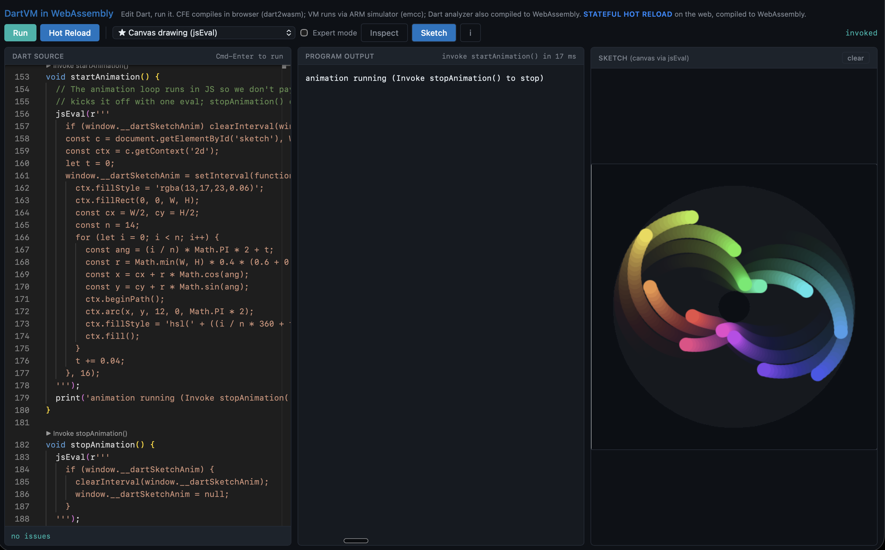

# Dart Live

The Dart VM, compiled to WebAssembly, running in your browser, with stateful
hot reload on the web.

**Live:** https://modulovalue.com/dart-live/



## What this is

A single-page app that runs the Dart toolchain entirely in your browser,
no server. You edit Dart, the CFE compiles it to kernel in the page, the
VM executes it in WebAssembly, and the analyzer reports diagnostics live
as you type.

## Features

- **Stateful hot reload** that actually preserves running state. Edit the
  program, click Hot Reload, keep going from where you were.
- **Invoke** any zero-argument top-level function from an inline CodeLens
  button above its declaration. The function runs on the live isolate.
- **JavaScript interop** through one embedder native. Dart code can call
  `alert`, `confirm`, `document.body`, `localStorage`, `Intl`, `canvas`,
  anything in the host's JS runtime.
- **Object Inspector** wired to the real VM Service Protocol. Walks the
  live isolate's libraries, fields, and instances with lazy expansion.
- **Sketch pane** with a `<canvas>` that user code can draw into via the
  JS interop.
- **Expert mode** exposes per-function IL views, including a Graphviz
  rendering of each compiler phase.
- **Live Dart analyzer**, the same one `dart analyze` runs locally,
  compiled to WebAssembly. It type-checks and inspects your code as
  you type, before you ever press Run, and surfaces every diagnostic
  (errors, warnings, hints, lints) as inline markers in Monaco.

## Table of contents

- [JavaScript interop](#javascript-interop)
- [Inspector](#inspector)
- [Sketch](#sketch)
- [Expert mode](#expert-mode)
- [Work in progress](#work-in-progress)
- [Samples](#samples)
- [How it works](#how-it-works)
- [Bundle](#bundle)
- [License](#license)

## JavaScript interop

User code reaches the host's JS runtime through a single embedder native,
`EmbedderJSEval`. One `external` declaration on the Dart side, one
`Dart_SetNativeResolver` on the user's root library, one `EM_ASM_PTR`
call on the C++ side. Arguments cross the boundary as JSON.

```dart
import 'dart:convert';

@pragma("vm:external-name", "EmbedderJSEval")
external String _jsEvalRaw(String code, String argsJson);

String jsEval(String code, [List<Object?> args = const []]) =>
    _jsEvalRaw(code, jsonEncode(args));

void showAlert() {
  jsEval('alert(a[0])', ['Hello from a Dart VM running in WebAssembly!']);
}

void formatWithIntl() {
  print(jsEval(
    'new Intl.NumberFormat(a[1], {style:"currency", currency:a[2]}).format(a[0])',
    [1234567.89, 'de-DE', 'EUR'],
  ));
}
```

Inside the JS snippet, `a` (also `args`) is the JSON-decoded argument
list. The result is whatever the JS expression evaluates to, stringified
(`JSON.stringify` for objects, `String(...)` for primitives). A leading
`!` on the returned string means JS threw. No SDK changes, no platform
rebuild.

## Inspector

A toggleable side pane (toolbar `Inspect` button) wired to the **VM
Service Protocol**. The patched `runtime/vm/service.{h,cc}` exposes a new
public entry point, `Service::InvokeRpcSync`, which dispatches a method
on the current isolate without going through a service isolate, ports,
or a WebSocket. The embedder forwards `getIsolate` / `getObject` calls
through that entry point and the JS-side panel renders top-level fields
with lazy expansion for lists, maps, and plain instances. Uninitialized
lazy fields show as `⟨NotInitialized⟩` (the protocol's Sentinel
response). The inspector auto-refreshes after Run, Hot Reload, and every
Invoke.

## Sketch

A second toggleable side pane (`Sketch` button) hosts a `<canvas
id="sketch">` element. User code draws into it via `jsEval`. A single
big eval per drawing means one C++ / JS hop for a whole scene; for
animation the loop lives in JS and Dart kicks it off with one call.

## Expert mode

The toggle in the toolbar reveals two extra CodeLens buttons above every
top-level function:

- `IL`, a text dump of the unoptimized flow graph from `Dart_CompileAll`.
- `IL Graph`, the same flow graph rendered with `@viz-js/viz`, one
  Graphviz `digraph` per compiler phase, with phase tabs across the top.

## Work in progress

Things that are sketched or partial and not yet wired into the live
deployment:

- **Optimized IL extraction for cold functions.** Today optimized IL
  shows only for functions the JIT has actually warmed up. A
  `Compiler::CompileOptimizedFunction` helper can force optimization,
  but linking it pulled in additional VM symbols that broke ReloadKernel
  for kernels with added top-level functions; reverting to a stub kept
  the trade-off favorable for now.
- **Full `dart:js` / `dart:js_interop` backend.** The current interop
  is a single string-based eval. Type-safe handles, real `JSObject`
  references, and the standard `dart:js_interop` API would be a fourth
  backend patch under `sdk/lib/_internal/vm/lib/` next to the existing
  `dart2js` / `dart2wasm` / `ddc` ones, plus a platform rebuild.
- **JS to Dart callbacks** without JSON marshalling. Per-frame
  animation driven from Dart (instead of the JS-owned `setInterval`
  loop the Sketch sample uses) needs a reverse callback path.
- **pub.dev package search.** Pulling a Dart-only package off
  pub.dev, resolving its deps client-side, and wiring it into the CFE
  so user code can `import 'package:...'`.

## Samples

Six starred samples open with the headline features:

- **Iterative π**, **Conway's Life**, **Bouncing particles** exercise
  stateful hot reload plus invoke: initialize once, tweak the algorithm,
  reload, keep going from where you were.
- **Counter** is the smallest demo of the same idea.
- **JavaScript interop (jsEval)** walks real browser APIs (alert,
  confirm, prompt, DOM, localStorage, Intl).
- **Canvas drawing (jsEval)** paints into the Sketch pane: a color
  wheel, two Mandelbrots, a spirograph, a Dart-computed curve, and a
  self-driving animation loop.

## How it works

1. You type Dart in Monaco.
2. Browser JS calls `dartCompile(source, vm_platform.dill)`, and the CFE
   wasm produces kernel bytes.
3. JS hands those bytes to `dart_il_run`, which has the VM wasm execute
   them through the ARM simulator.
4. `print` calls in Dart go through an `EM_ASM` bridge back to JS, which
   updates the DOM.
5. **Run** orphans the prior isolate and creates a fresh one, so state
   resets.
6. **Hot Reload** calls `IsolateGroup::ReloadKernel` in place. Top-level
   fields keep their values, but the library code is swapped to the new
   kernel. After the reload `main()` re-runs so lazy initializers for
   newly-added top-level fields fire.
7. **Invoke** (the inline CodeLens above every zero-arg top-level function)
   calls that function on the live isolate via `Dart_Invoke`, bypassing
   entry-point pragmas via `--no-verify-entry-points`.
8. `Future.delayed` actually waits wall-clock time. `_embedderSleep`
   forwards to `emscripten_sleep` via Asyncify, so the JS event loop
   stays responsive.
9. The analyzer runs in parallel against `dart_sdk.sum` and feeds Monaco
   via `setModelMarkers`.

## Bundle

The browser pulls these files; no server is involved:

| component | wasm size | role |
|---|---:|---|
| `dart_il.wasm` | 9.7 MB | Dart VM (emcc, ARM simulator) |
| `dart_cfe.wasm` | 2.4 MB | Common front-end (dart2wasm), Dart to kernel |
| `dart_analyzer.wasm` | 2.5 MB | Dart analyzer (dart2wasm) |
| `vm_platform.dill` | 8.3 MB | Platform kernel (dart:core, dart:async, ...) |
| `dart_sdk.sum` | 3.2 MB | Analyzer SDK summary |

Total: about 26 MB uncompressed, 7.6 MB gzipped.

## License

This repository contains a built artifact bundle. Build inputs and patches
live in a separate working tree (Dart SDK plus an emcc-built embedder).
