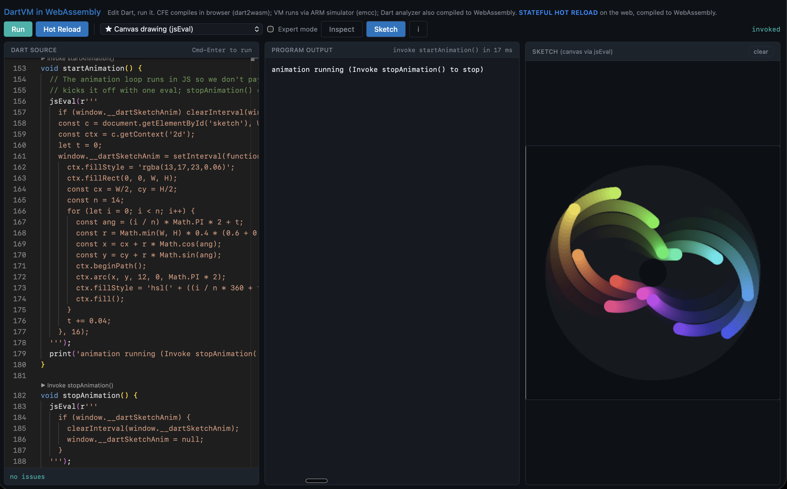

# Dart Live

The Dart VM, compiled to WebAssembly, running in your browser, with stateful
hot reload on the web.

**Live:** https://modulovalue.com/dart-live/



## What this is

A single-page app that runs the Dart toolchain entirely in your browser,
no server. You edit Dart, the CFE compiles it to kernel in the page, the
VM executes it in WebAssembly, and the analyzer reports diagnostics live
as you type.

## Features

- **Stateful hot reload** that actually preserves running state. Edit the
  program, click Hot Reload, keep going from where you were.
- **Invoke** any zero-argument top-level function from an inline CodeLens
  button above its declaration. The function runs on the live isolate.
- **JavaScript interop** through one embedder native. Dart code can call
  `alert`, `confirm`, `document.body`, `localStorage`, `Intl`, `canvas`,
  anything in the host's JS runtime.
- **Object Inspector** wired to the real VM Service Protocol. Walks the
  live isolate's libraries, fields, and instances with lazy expansion.
- **Sketch pane** with a `<canvas>` that user code can draw into via the
  JS interop.
- **Expert mode** exposes per-function IL views, including a Graphviz
  rendering of each compiler phase.
- **Live Dart analyzer (LSP)**, the full analysis server `dart analyze`
  uses locally, compiled to WebAssembly and exposed to the page over a
  JSON-RPC bridge. Live diagnostics (errors, warnings, hints, lints),
  completion (including auto-import from unimported libraries), and
  hover docs -- the same IDE experience you get in VS Code or IntelliJ,
  running entirely in your browser with no language-server backend.

## Table of contents

- [JavaScript interop](#javascript-interop)
- [Inspector](#inspector)
- [Sketch](#sketch)
- [Expert mode](#expert-mode)
- [Work in progress](#work-in-progress)
- [Samples](#samples)
- [How it works](#how-it-works)
- [Bundle](#bundle)
- [External packages](#external-packages)
- [License](#license)

## JavaScript interop

User code reaches the host's JS runtime through a single embedder native,
`EmbedderJSEval`. One `external` declaration on the Dart side, one
`Dart_SetNativeResolver` on the user's root library, one `EM_ASM_PTR`
call on the C++ side. Arguments cross the boundary as JSON.

```dart
import 'dart:convert';

@pragma("vm:external-name", "EmbedderJSEval")
external String _jsEvalRaw(String code, String argsJson);

String jsEval(String code, [List<Object?> args = const []]) =>
    _jsEvalRaw(code, jsonEncode(args));

void showAlert() {
  jsEval('alert(a[0])', ['Hello from a Dart VM running in WebAssembly!']);
}

void formatWithIntl() {
  print(jsEval(
    'new Intl.NumberFormat(a[1], {style:"currency", currency:a[2]}).format(a[0])',
    [1234567.89, 'de-DE', 'EUR'],
  ));
}
```

Inside the JS snippet, `a` (also `args`) is the JSON-decoded argument
list. The result is whatever the JS expression evaluates to, stringified
(`JSON.stringify` for objects, `String(...)` for primitives). A leading
`!` on the returned string means JS threw. No SDK changes, no platform
rebuild.

## Inspector

A toggleable side pane (toolbar `Inspect` button) wired to the **VM
Service Protocol**. The patched `runtime/vm/service.{h,cc}` exposes a new
public entry point, `Service::InvokeRpcSync`, which dispatches a method
on the current isolate without going through a service isolate, ports,
or a WebSocket. The embedder forwards `getIsolate` / `getObject` calls
through that entry point and the JS-side panel renders top-level fields
with lazy expansion for lists, maps, and plain instances. Uninitialized
lazy fields show as `⟨NotInitialized⟩` (the protocol's Sentinel
response). The inspector auto-refreshes after Run, Hot Reload, and every
Invoke.

## Sketch

A second toggleable side pane (`Sketch` button) hosts a `<canvas
id="sketch">` element. User code draws into it via `jsEval`. A single
big eval per drawing means one C++ / JS hop for a whole scene; for
animation the loop lives in JS and Dart kicks it off with one call.

## Expert mode

The toggle in the toolbar reveals two extra CodeLens buttons above every
top-level function:

- `IL`, a text dump of the unoptimized flow graph from `Dart_CompileAll`.
- `IL Graph`, the same flow graph rendered with `@viz-js/viz`, one
  Graphviz `digraph` per compiler phase, with phase tabs across the top.

## Work in progress

Things that are sketched or partial and not yet wired into the live
deployment:

- **Optimized IL extraction for cold functions.** Today optimized IL
  shows only for functions the JIT has actually warmed up. A
  `Compiler::CompileOptimizedFunction` helper can force optimization,
  but linking it pulled in additional VM symbols that broke ReloadKernel
  for kernels with added top-level functions; reverting to a stub kept
  the trade-off favorable for now.
- **Full `dart:js` / `dart:js_interop` backend.** The current interop
  is a single string-based eval. Type-safe handles, real `JSObject`
  references, and the standard `dart:js_interop` API would be a fourth
  backend patch under `sdk/lib/_internal/vm/lib/` next to the existing
  `dart2js` / `dart2wasm` / `ddc` ones, plus a platform rebuild.
- **JS to Dart callbacks** without JSON marshalling. Per-frame
  animation driven from Dart (instead of the JS-owned `setInterval`
  loop the Sketch sample uses) needs a reverse callback path.
- **pub.dev package search.** Pulling a Dart-only package off
  pub.dev, resolving its deps client-side, and wiring it into the CFE
  so user code can `import 'package:...'`.

## Samples

Six starred samples open with the headline features:

- **Iterative π**, **Conway's Life**, **Bouncing particles** exercise
  stateful hot reload plus invoke: initialize once, tweak the algorithm,
  reload, keep going from where you were.
- **Counter** is the smallest demo of the same idea.
- **JavaScript interop (jsEval)** walks real browser APIs (alert,
  confirm, prompt, DOM, localStorage, Intl).
- **Canvas drawing (jsEval)** paints into the Sketch pane: a color
  wheel, two Mandelbrots, a spirograph, a Dart-computed curve, and a
  self-driving animation loop.

## How it works

1. You type Dart in Monaco.
2. Browser JS calls `dartCompile(source, vm_platform.dill)`, and the CFE
   wasm produces kernel bytes.
3. JS hands those bytes to `dart_il_run`, which has the VM wasm execute
   them through the ARM simulator.
4. `print` calls in Dart go through an `EM_ASM` bridge back to JS, which
   updates the DOM.
5. **Run** orphans the prior isolate and creates a fresh one, so state
   resets.
6. **Hot Reload** calls `IsolateGroup::ReloadKernel` in place. Top-level
   fields keep their values, but the library code is swapped to the new
   kernel. After the reload `main()` re-runs so lazy initializers for
   newly-added top-level fields fire.
7. **Invoke** (the inline CodeLens above every zero-arg top-level function)
   calls that function on the live isolate via `Dart_Invoke`, bypassing
   entry-point pragmas via `--no-verify-entry-points`.
8. `Future.delayed` actually waits wall-clock time. `_embedderSleep`
   forwards to `emscripten_sleep` via Asyncify, so the JS event loop
   stays responsive.
9. The LSP server (`dart_lsp.wasm`) runs in parallel against
   `dart_sdk.sum` + an optional `dart_packages.bin` external-package
   source bundle. It speaks LSP JSON-RPC over a JS bridge
   (`globalThis.lspSend` / `lspReceive`); the page wires this to Monaco's
   completion provider, hover provider, and `setModelMarkers` for
   diagnostics.

## Bundle

The browser pulls these files; no server is involved:

| component | wasm size | role |
|---|---:|---|
| `dart_il.wasm` | 9.7 MB | Dart VM (emcc, ARM simulator) |
| `dart_cfe.wasm` | 2.4 MB | Common front-end (dart2wasm), Dart to kernel |
| `dart_lsp.wasm` | 4.4 MB | Dart analysis server (dart2wasm). Speaks LSP over a JS bridge: diagnostics, completion, hover, auto-import. |
| `vm_platform.dill` | 8.3 MB | Platform kernel (dart:core, dart:async, ...) |
| `dart_sdk.sum` | 3.2 MB | Analyzer SDK summary |
| `dart_packages.bin` | 0.9 MB | Default external-packages source bundle (`meta`, `collection`, `async`). Optional, see below. |

Total: about 29 MB uncompressed, ~8 MB gzipped.

## External packages

Embedders ship two kinds of artifacts for external packages:

- **Kernel dills** (one per top-level package), used by the VM at run time
  for `import 'package:foo/...'` to actually execute.
- **A single source bundle** (one DPKG blob covering every package and
  its transitive deps), used by the analyzer for live diagnostics + the
  upcoming completion / hover / goto-definition surface.

Declare them on `window` before the dart-live script tag loads:

```html
<script>
  window.dartLivePackages = [
    { name: 'knex_dart', dillUrl: './knex_dart.dill' },
  ];
  window.dartLivePackagesBundle = './dart_packages.bin';
</script>
```

Either field is optional. With no `dartLivePackages`, `import 'package:...'`
won't execute. With no `dartLivePackagesBundle`, the page tries to fetch
`./dart_packages.bin` next to `index.html` -- this repo ships a default
one covering `meta`, `collection`, and `async`, so those imports just
work out of the box. If neither the override nor the default bundle is
present, the analyzer will red-underline external imports but everything
else still works.

### Build a `dartLivePackagesBundle` from pub.dev

The packer is a single node script in this repo:
[`tools/pack_pub_packages.mjs`](tools/pack_pub_packages.mjs). It walks
the transitive dependency graph from pub.dev's HTTP API, downloads each
tarball, extracts it in memory, and emits the DPKG blob in one shot:

```sh
node tools/pack_pub_packages.mjs dart_packages.bin knex_dart
```

You can list multiple seeds. For `knex_dart 1.2.0` the closure is 7
packages (`knex_dart`, `logging`, `meta`, `collection`,
`knex_dart_capabilities`, `universal_io`, `typed_data`) at ~1.4 MB.

Version selection: latest stable satisfying the parent's `^x.y.z`
constraint, first-resolved wins (no diamond reconciliation). Good
enough for embedded playgrounds; for fully reproducible solves port
`package:pub_semver` + a real solver.

### Build a kernel dill on the host

For each top-level package you want to execute:

```sh
dart compile kernel \
    --platform=vm_platform.dill \
    -o knex_dart.dill \
    lib/knex_dart.dart
```

Drop `vm_platform.dill` next to your build (or fetch it from this repo).
The resulting dill resolves `package:knex_dart/knex_dart.dart` at runtime
in the in-page VM.

### Bundle format reference (DPKG)

A single binary blob. Little-endian throughout:

```
bytes 0..3 : ascii "DPKG"
u32        : nPackages
for each package:
  u32      : nameLen, then nameLen utf-8 bytes (package name)
  u32      : nFiles
  for each file:
    u32    : pathLen, then pathLen utf-8 bytes (relative path)
    u32    : contentLen, then contentLen file bytes
```

Files are mounted at `/ext_pkg_<i>/<relPath>` inside the wasm's
`MemoryResourceProvider`. The analyzer builds a synthetic
`package_config.json` listing every package, and a synthetic
`user/pubspec.yaml` that declares every mounted package as a dependency
of the user file (otherwise the analyzer's `_PubFilter` hides their
symbols from unimported-libraries completion).

### What happens when a dependency is missing

Source-based loading degrades gracefully: a missing package surfaces as
a localized "Target of URI doesn't exist" diagnostic on the offending
`import` line, every identifier from that import becomes "Undefined
name", and **the rest of the file analyzes normally**. Hover, completion,
and goto-def on code that doesn't touch the missing import keep working.
This is the same UX you get in a real IDE when you forget to `pub get`.

Compare to the old summary-based path, which threw
`ArgumentError: Missing library: ...` from
`LinkedElementFactory._reportMissingLibrary` and collapsed the entire
analysis request. That old path is gone -- `dart_analyzer.wasm` only
accepts the DPKG bundle now.

### Limitations

- **Generated code.** Packages that rely on `build_runner` codegen
  (`freezed`, `json_serializable`, `drift`, ...) only ship hand-written
  source in their pub tarball; generated files are not in the bundle.
  References to generated symbols flag as undefined.
- **Bundle size.** Every `.dart` file in each package ships, plus
  incidental files from the tarball (`README`, `CHANGELOG`, examples).
  For a few-MB closure that's fine; for "all of pub.dev" you would
  filter to `lib/**` in the packer.
- **No private packages.** The packer only reads from pub.dev. For
  local / git / forked packages, pack any directory tree into a DPKG
  blob yourself -- the format is intentionally trivial.

### Live example

https://playground.knex.mahawarkartikey.in embeds dart-live with the
`knex_dart` package preloaded both ways, so you can write
`import 'package:knex_dart/knex_dart.dart';` and have it resolve,
compile, run, and type-check in the browser.

Also: https://github.com/code-shoily/kino_yogex_playground

## License

This repository contains a built artifact bundle. Build inputs and patches
live in a separate working tree (Dart SDK plus an emcc-built embedder).
